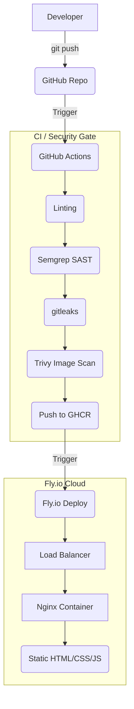

# Pacome.dev - DevOps Portfolio


A professional, containerized personal portfolio demonstrating modern Full-Stack development and DevOps best practices. Developed as a final project for the Computer Engineering curriculum at BEÜ.

## 🌐 Live Demo
- **URL**: [https://pacome.dev](https://pacome-portfolio.fly.dev) *(Custom domain pending DNS propagation)*
- **Demo Video**: [Link to Unlisted YouTube Video](#)

## 🏗️ Architecture & DevOps Pipeline

This project employs a robust CI/CD pipeline ensuring code quality, security, and zero-downtime deployments.



## 🛠️ Technology Stack

- **Frontend**: Vanilla HTML5, CSS3 (Glassmorphism, Dark Mode), Vanilla JS
- **Containerization**: Docker (Multi-stage build), Docker Compose
- **Web Server**: Nginx (configured with gzip, security headers, `/health` endpoint)
- **CI/CD**: GitHub Actions
- **Security Scanners**: Semgrep, Trivy, Gitleaks
- **Deployment**: Fly.io
- **Observability**: Better Stack Uptime

## 🚀 Local Development

1. Clone the repository:
   ```bash
   git clone https://github.com/Pacome5110/portfolyo.git
   cd portfolyo
   ```
2. Start using Docker Compose:
   ```bash
   docker-compose up -d
   ```
3. Visit `http://localhost:8080` in your browser.
4. Verify health endpoint: `curl http://localhost:8080/health`

## 🤖 AI Usage Declaration
I used Google's Gemini / DeepMind AI assistant strictly as a pair-programming tool to accelerate boilerplate generation (like GitHub Actions YAML files and Nginx configs) and to assist with CSS flexbox/grid layout structures. All content, project descriptions, skills, and architectural decisions reflect my personal work and experience.
